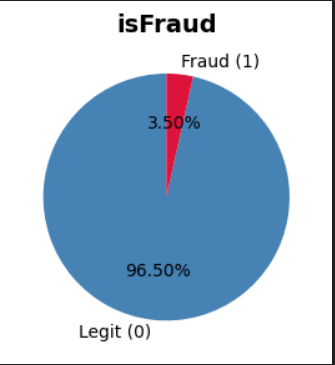
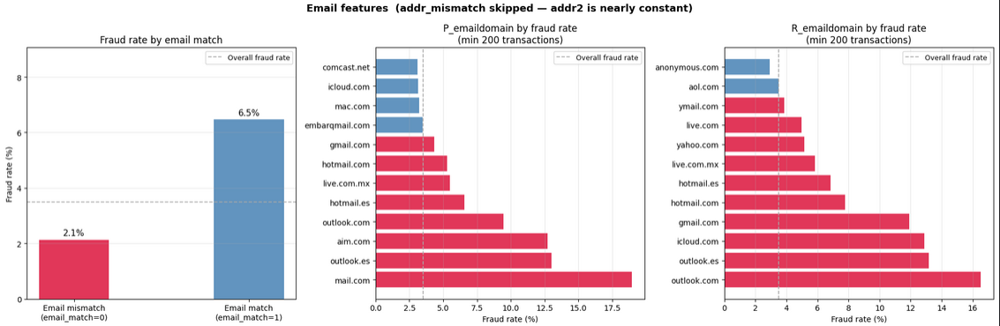
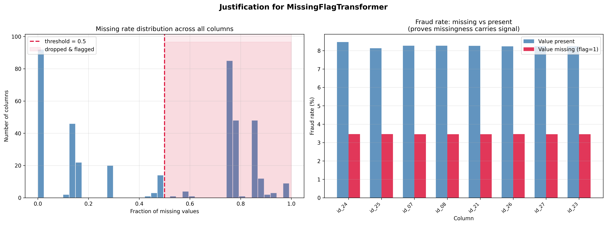
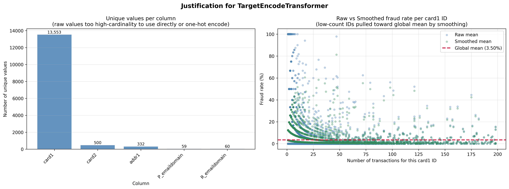
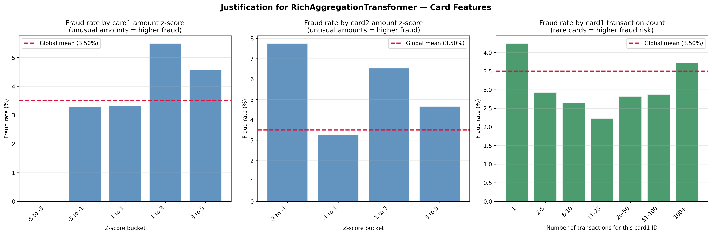
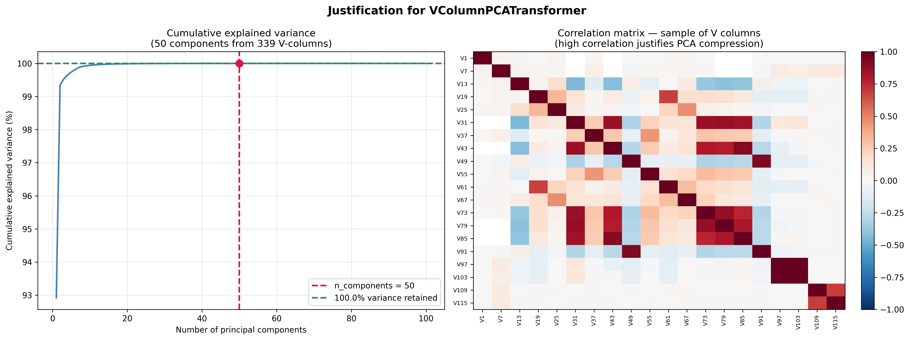
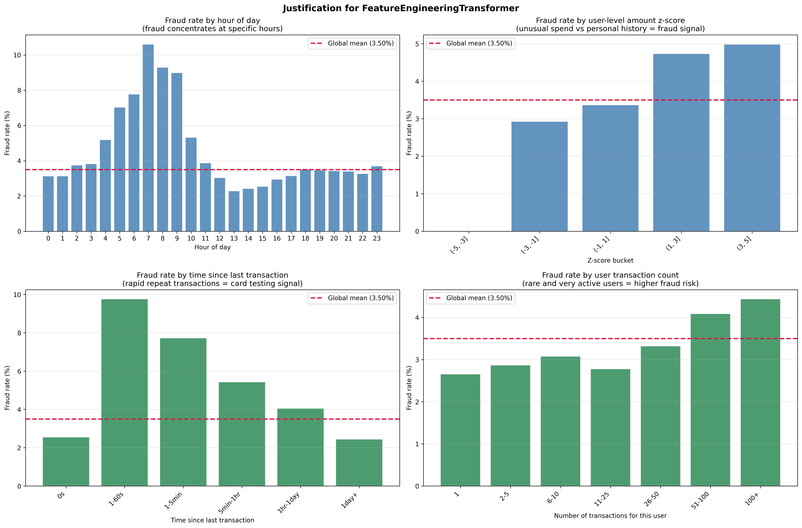
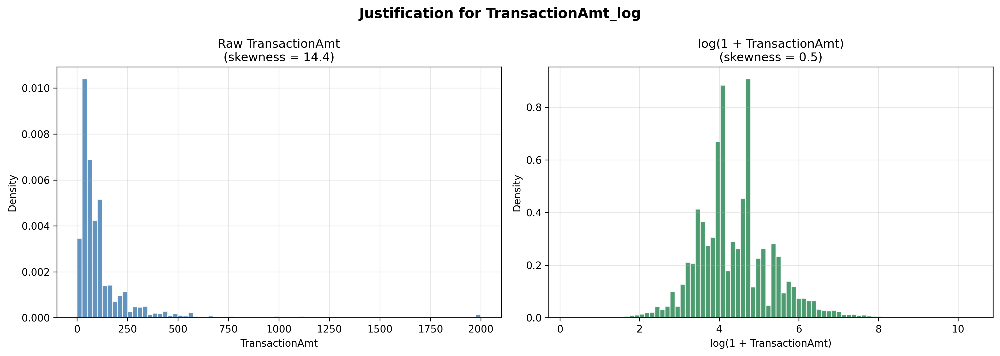
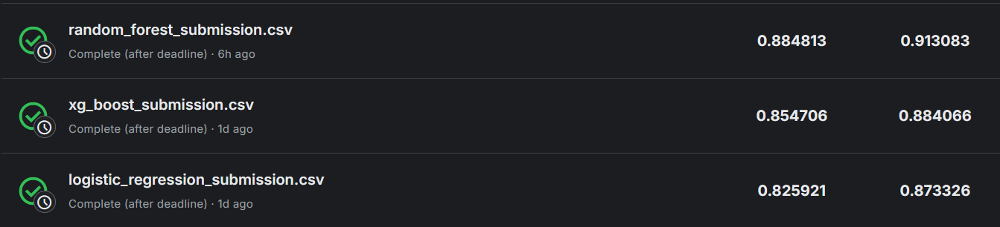

# ML_assn_02: IEEE-CIS Fraud Detection

## პროექტის მიმოხილვა

ეს პროექტი არის Kaggle-ის IEEE-CIS Fraud Detection-ზე. დავალების მიზანია საკრედიტო ბარათის ტრანზაქციებში თაღლითობის აღმოჩენა. 
დატასეტი შედგება ორი ცხრილისგან — `train_transaction.csv` და `train_identity.csv` — რომლებიც `TransactionID`-ით
ერთმანეთთან არის დაკავშირებული. სულ გვაქვს 590,000-ზე მეტი ტრანზაქცია, სადაც მხოლოდ ~3.5%
არის თაღლითური, რაც კლასების მძიმე დისბალანსს ქმნის.

### მიდგომა

გავტესეტე სამ სხვადასხვა მოდელის არქიტექტურაზე: Logistic Regression, XGBoost და Random Forest.
თითოეული მოდელისათვის შევქმენი sklearn Pipeline, რომელიც პირდაპირ raw test set-ზე ეშვება
preprocessing-ის გარეშე. ყველა ექსპერიმენტი დავლოგე MLflow-ში DagHub-ზე.

კლასების დისბალანსი დავამუშავე შემდეგნაირად:
- Logistic Regression და Random Forest: `class_weight='balanced'`
- XGBoost: `scale_pos_weight=neg_pos_ratio` (~27, რაც გამოვთვალეთ train სეტიდან)

---

## რეპოზიტორიის სტრუქტურა

| ფაილი | აღწერა |
|---|---|
| `model_experiment_LogisticRegression.ipynb` | Logistic Regression — cleaning, feature engineering, feature selection, training |
| `model_experiment_XGBoost.ipynb` | XGBoost — cleaning, feature engineering, hyperparameter tuning |
| `model_experiment_RandomForest.ipynb` | Random Forest — cleaning, feature engineering, feature selection, training |
| `model_inference.ipynb` | საუკეთესო მოდელის ჩატვირთვა Model Registry-იდან და submission-ის გენერაცია |
| `README.md` | პროექტის სრული აღწერა |

---

## Data Cleaning

### გამოტოვებული მნიშვნელობების დამუშავება

დატასეტში ბევრ სვეტს ჰქონდა მაღალი missing rate. ამიტომ გამოვიყენეთ შემდეგი მიდგომა:

**50%-ზე მეტი missing მქონე სვეტები** — პირდაპირ წავშალეთ, მაგრამ მათ ნაცვლად შევქმენით
binary flag სვეტები (`col_missing`), რომლებიც 1-ს შეიცავს თუ მნიშვნელობა გამოტოვებული იყო.
ეს მიდგომა მნიშვნელოვანია, რადგანაც თავად გამოტოვება შეიძლება სიგნალი იყოს — ბევრ V სვეტში
მნიშვნელობის არარსებობა შეიძლება კორელაციაში იყოს თაღლითობასთან.

**კატეგორიული სვეტები** — გამოტოვებული მნიშვნელობები შეივსო `'unknown'`-ით სანამ Label
Encoding მოხდებოდა.

**რიცხვითი სვეტები** — pipeline-ში `SimpleImputer(strategy='median')`-ით ივსება logistic 
regression-ისთვის, რასაც ზოგადად ვაკეთებთ ხოლმე. 

### კატეგორიული სვეტების კოდირება

გამოვიყენეთ სამი სხვადასხვა encoding სტრატეგია სხვადასხვა მოდელისათვის:

**Label Encoding** — ყველა მოდელში. კატეგორიულ სვეტებს ანიჭებს რიცხვით მნიშვნელობებს.
`fit`-ის დროს ინახავს კატეგორიული სვეტების სიას, ხოლო `transform`-ის დროს უცნობ მნიშვნელობებს
`'unknown'`-ით ცვლის, რათა test set-ზე error არ მოხდეს. მაგის მერე გადაყავს რიხვებში.

**Target Encoding** — XGBoost და Random Forest pipeline-ებში მაღალ-კარდინალური სვეტებისათვის
(`card1`, `card2`, `addr1`, `P_emaildomain`, `R_emaildomain`), თითოეულ კატეგორიას ენიჭება
შესაბამისი fraud rate smoothing-ით. smoothing პარამეტრი (default=10) თავიდან აცილებს
overfitting-ს მცირე ჯგუფებისათვის — პატარა ჯგუფები გლობალური საშუალოსკენ იწევს.
ეს განსაკუთრებით მნიშვნელოვანია, რადგანაც `card1`-ს ათასობით უნიკალური მნიშვნელობა აქვს.

---

## Feature Engineering

### Custom Transformer კლასები

ყველა feature engineering მოვათავსეთ sklearn-compatible transformer კლასებში, რათა
pipeline-ში სწორად ფავუშვათ და data leakage არ გვქონდეს. ამისთვის ყველა კლასმა
დააიმპლემენტირა __init__, fit და transform ფუნქციები.

#### `DropIDTransformer`
`TransactionID` სვეტს შლის. ეს სვეტი უნიკალური იდენტიფიკატორია და პროგნოზულ ძალას
არ შეიცავს — თუ pipeline-ში დარჩება, მოდელი შეისწავლის ID-ებს და test set-ზე
განზოგადება ვერ მოხდება.

#### `EmailMatchTransformer`
ქმნის email_match სვეტს — 1 თუ P_emaildomain და R_emaildomain ემთხვევა.
მონაცემები აჩვენებს, რომ იმეილების დამთხვევა (email_match=1) თაღლითობის უფრო ძლიერი სიგნალია (6.5%), ვიდრე მათი განსხვავება (2.1%). 
ეს მიუთითებს იმაზე, რომ თაღლითები ხშირად იყენებენ ერთსა და იმავე დომეინს (მაგ. outlook.com ან mail.com) როგორც მყიდველის,
ისე მიმღების ველში პროცესის გამარტივებისთვის ან ავტომატიზირებული შეტევების დროს.

#### `MissingFlagTransformer`
50%-ზე მეტი missing მქონე სვეტებს შლის და მათ ნაცვლად binary flag სვეტებს ქმნის.
`fit`-ის დროს ინახავს სვეტების სიას, `transform`-ის დროს კი ამ სიას იყენებს — ეს
გარანტიას იძლევა, რომ train და test set-ებზე ერთი და იგივე სვეტები დამუშავდება.

#### `LabelEncodeTransformer`
კატეგორიულ სვეტებს Label Encoding-ს უკეთებს. standard sklearn `LabelEncoder`-ისგან
განსხვავებით, ეს კლასი ჰენდლავს უცნობ მნიშვნელობებს test set-ზე — ისინი
`'unknown'`-ად გადაიქცევა error-ის ნაცვლად.

#### `TargetEncodeTransformer`
ეს კლასი ახდენს მაღალი კარდინალურობის მქონე კატეგორიული სვეტების (მაგ. card1, card2, addr1, P_emaildomain, R_emaildomain) 
რიცხვით წარმოდგენას Target Encoding მეთოდის გამოყენებით. მარტივად რომ ვთქვათ, თითოეული კატეგორიული მნიშვნელობა 
(მაგალითად email domain) ჩანაცვლდება ისეთი რიცხვით, რომელიც ასახავს ამ კატეგორიაში თაღლითობის (target = 1) საშუალო სიხშირეს.
კლასი იყენებს smoothing ფორმულას, რის შედეგადაც მცირე რაოდენობის ჩანაწერების მქონე კატეგორიების საშუალო მნიშვნელობა მიიწევს 
გლობალური საშუალოსკენ. ეს ამცირებს overfitting-ის რისკს იშვიათ კატეგორიებზე. Data leakage თავიდან აცილებულია, 
რადგან fit() ფუნქცია მუშაობს მხოლოდ სატრენინგო მონაცემებზე. ხოლო validation/test მონაცემებში, თუ გამოჩნდება უცნობი კატეგორია,
მას ავტომატურად ენიჭება გლობალური საშუალო მნიშვნელობა.

#### `RichAggregationTransformer`
ცუდი სახელია აშკარად, მაგრამ ეს კლასი ქმნის ახალ feature-ებს არსებული სვეტებიდან, რომლებიც აღწერენ თითოეული ბარათის ქცევის პატერნს — რადგან ერთი ტრანზაქცია 
კონტექსტის გარეშე ნაკლებად ინფორმაციულია, მაგრამ იმის ცოდნა, რომ ეს ბარათი ჩვეულებრივ 20-იან ტრანზაქციებს აკეთებს და უცბად
900 დახარჯა, ძლიერი სიგნალია. card1 და card2-ისთვის ითვლება საშუალო თანხა, სტანდარტული გადახრა, ტრანზაქციების რაოდენობა
და z-score — რომელიც გვიჩვენებს რამდენად უჩვეულოა მიმდინარე თანხა ამ ბარათის ისტორიისთვის. გრაფიკულმა ანალიზმა დაადასტურა,
რომ z-score და ტრანზაქციების რაოდენობა რეალურ სიგნალს შეიცავს — განსაკუთრებით იშვიათი და ძალიან აქტიური ბარათები უფრო მაღალ 
თაღლითობის მაჩვენებელს აჩვენებენ. ასევე იქმნება user_id კომბინირებული იდენტიფიკატორი (card1 + card2 + addr1-დან) დროის 
სტატისტიკებისთვის, და დამხმარე ბინარული სვეტები amt_is_round, amt_is_round_100 და addr_mismatch — თუმცა ამ უკანასკნელთა
სიგნალი მონაცემებში სუსტი აღმოჩნდა. fit მხოლოდ train set-ზე ითვლის სტატისტიკებს, transform კი join-ით მიამაგრებს — 
რაც data leakage-ს თავიდან აიცილებს.

#### `VColumnPCATransformer`
დატასეტში 339 V სვეტია — Vesta-ს ანონიმური feature-ები. ეს სვეტები:
- ძლიერ კორელირებულია ერთმანეთთან
- ძალიან მაღალი missing rate-ით ხასიათდება

`VColumnPCATransformer` ამ სვეტებს median imputation-ის შემდეგ 50 ძირითად სვეტად
კუმშავს. ეს ორ პრობლემას ერთდროულად წყვეტს — redundancy-ს და რაოდენობას.

#### `FeatureEngineeringTransformer`
ქმნის user-level სტატისტიკებს ხელოვნური `user_id`-ის გამოყენებით
(`card1 + card2 + addr1 + P_emaildomain`):

| სვეტი | აღწერა | რატომ                                                                        |
|---|---|------------------------------------------------------------------------------|
| `hour`, `day` | საათი და კვირის დღე `TransactionDT`-იდან | თაღლითობა ხასიათდება ამ მონაცემებით, მარტო TransactionDT არ გვაძლევს არაფერს |
| `TransactionAmt_log` | log(1 + თანხა) | ისე თანხას არ აქვს ნორმალური განაწილების ფორმა, ეს მაგ ფორმას აძლევს         |
| `TransactionAmt_cents` | თანხის ათწილადი ნაწილი | თაღლითები შეიძლება მრგვალ თანხებს იყენებენ                                   |
| `user_id_count` | მომხმარებლის ტრანზაქციების რაოდენობა | ბევრი, უჩვეულო აქტივობა თაღლითობის სიგნალია                                  |
| `user_id_mean_amt` | მომხმარებლის საშუალო თანხა | პერსონალური ხარჯვის მანიშნებელი                                              |
| `user_id_std_amt` | მომხმარებლის თანხის გადახრა | სტაბილურ მომხმარებლებს მცირე std ექნებათ                                     |
| `user_id_max_amt` | მომხმარებლის მაქსიმალური თანხა | ახალი მაქსიმუმი — საეჭვო                                                     |
| `user_amt_zscore` | z-score მომხმარებლის ნორმიდან | ძირითადი ანომალიის დასადგენი სიგნალი                                         |
| `user_amt_ratio` | თანხა / მომხმარებლის საშუალო | ანალოგიური zscore-ისა, ratio სკალაზე                                         |
| `user_id_count_log` | log(transaction count) | ნორმალურ განაწილებას აძლევს შედარებით                                        |
| `amt_vs_max` | თანხა / მომხმარებლის მაქსიმუმი | ახლო 1-თან = ყველაზე დიდი ტრანზაქცია                                         |
| `user_time_delta` | წამები ბოლო ტრანზაქციიდან | სწრაფი გამეორებები თუ არის ესეიგი ტესტავენ ბარათს                            |

მნიშვნელოვანია, რომ `user_stats` მხოლოდ `fit`-ის დროს გამოითვლება train set-ზე,
ხოლო `transform`-ის დროს join-ით მიემაგრება. ეს data leakage-ს გამორიცხავს.

---

## Feature Selection

გამოვიყენეთ ორი custom feature selection კლასი:

### `IVSelector` (Information Value)

Information Value ზომავს თითოეული სვეტის პროგნოზულ ძალას target-თან მიმართებაში.
გამოვიყენეთ threshold=0.02 — სტანდარტული ზღვარი, რომლის ქვემოთ სვეტი არაპროგნოზულად
ითვლება.

მუშაობს სწრაფად 50,000-ის sample-ზე და Parallel-ით ამუშავებს სვეტებს ერთდროულად.
Logistic Regression-ში ეს იყო ერთადერთი feature selection სტრატეგია.

### `CorrelationFilter`

იღებს სვეტების წყვილებს, სადაც კორელაცია 0.85-ს აღემატება, და ორიდან უფრო
redundant-ს (მეტი საშუალო კორელაცია სხვა სვეტებთან) შლის. ეს თავიდან
აიცილებს multicollinearity-ს, რაც წრფივ მოდელებს ეხმარება.

### სტრატეგიების შედარება (Random Forest)

| სტრატეგია | სვეტების რაოდენობა | Val AUC | Gap |
|---|---|---|---|
| No Selection | 170 | 0.9255 | 0.0209 |
| IV Only | 160 | 0.9250 | 0.0212 |
| IV + Corr Filter | 101 | 0.9154 | 0.0270 |

---

## ტრენინგი და ექსპერიმენტები

### Logistic Regression

`model_experiment_LogisticRegression.ipynb`

LR-ისათვის pipeline შედგება: `DropID -> EmailMatch -> MissingFlag -> LabelEncode ->
FeatureEngineering -> Imputer -> IVSelector -> StandardScaler -> LogisticRegression`

StandardScaler აუცილებელია LR-ისათვის — ფიჩერების სხვადასხვა შკალაზე ყოფნა
კოეფიციენტებს ამახინჯებს. `solver='saga'` გამოვიყენეთ, რადგანაც L1 და L2
regularization-ს ერთნაირად მხარს უჭერს და დიდ დატასეტებზე სწრაფია.

გავრესეტე L1 და L2 regularization სხვადასხვა C მნიშვნელობით (0.01, 0.1, 1):

| მოდელი | Penalty | C | CV AUC | Val AUC | Gap |
|---|---|---|---|---|---|
| LR_CV_L2 | L2 | 0.1 | 0.8398 | 0.8440 | -0.0004 |
| LR_CV_L1 | L1 | 0.1 | 0.8398 | 0.8440 | -0.0004 |

**საბოლოო LR pipeline val AUC: 0.844326244495975**

LR-ის შეზღუდვა ამ დატასეტზე: მოდელი ითვლის წრფივ ურთიერთობებს ფიჩერებსა
და პასუხს შორის. fraud detection-ში ურთიერთობები ხშირად არაწრფივია, ამიტომ
LR-ს ლიმიტი აქვს და ვერ სწავლობს კარგად. 

### XGBoost

`model_experiment_XGBoost.ipynb`

XGBoost pipeline-ი უფრო მეტი feature engineering-ით:
`DropID -> EmailMatch -> MissingFlag -> RichAggregation -> TargetEncode ->
LabelEncode -> FeatureEngineering -> VColumnPCA(50) -> XGBClassifier`

XGBoost-ისათვის feature selection არ გამოვიყენეთ ცალკე — იგი თავისით
ახდენს feature selection-ს ხეების სტრუქტურის მეშვეობით და არარელვანტურ
სვეტებს უბრალოდ არ გამოიყენებს split-ებში.

`VColumnPCATransformer` სპეციალურად XGBoost pipeline-ისათვის დავამატეთ —
339 V სვეტი 50 PCA კომპონენტად შევკუმშეთ, რაც მეხსიერებას ამცირებს და
კორელირებულ სვეტებს შორის redundancy-ს გამორიცხავს.

**Hyperparameter Grid:**

| პარამეტრი | გამოცდილი მნიშვნელობები |
|---|---|
| `max_depth` | 8, 10 |
| `learning_rate` | 0.05 |
| `subsample` | 0.8, 0.9 |
| `colsample_bytree` | 0.8 |
| `reg_alpha` | 0.5 |
| `reg_lambda` | 2 |
| `n_estimators` | 500, 700 |

საუკეთესო პარამეტრები: `max_depth=10, n_estimators=700, subsample=0.9`

| მეტრიკა | მნიშვნელობა |
|---|---|
| CV AUC | 0.9476 |
| Train AUC | 0.9999935593666168 |
| Val AUC | 0.9625 |
| Overfit Gap | 0.0375 |

**საბოლოო XGB pipeline val AUC: 0.9625120172131423**

Train AUC თითქმის 1 ნიშნავს, რომ მოდელი სატრენინგო მონაცემებს მთლიანად
ოზეპირებს — კლასიკური overfit-ის სიგნალი. თუმცა val AUC = 0.9625 მაინც ძლიერია,
რაც იმას ნიშნავს რომ overfit-ი კრიტიკული არ არის — მოდელი სასარგებლო პატერნებს
სწავლობს და არა მხოლოდ ნოიზს. Gap = 0.0375 LR-ის -0.0004-თან შედარებით
პირდაპირ ასახავს განსხვავებას: LR underfit-ს აკეთებს, XGBoost კი ოდნავ overfit-ს,
მაგრამ გაცილებით უკეთეს ვალიდაციის შედეგს იძლევა.

### Random Forest

`model_experiment_RandomForest.ipynb`

RF pipeline: `DropID -> EmailMatch -> MissingFlag -> RichAggregation ->
TargetEncode -> LabelEncode -> FeatureEngineering -> VColumnPCA(50) -> RandomForest`

თავიდან max_depth 8, 12, None; n_estimators 200, 400; min_samples_leaf=5 და 1 გავუშვი და 3 საათის ტრეინის მერე,
დალოგვას როცა იწყებდა რატომღაც keyboard interrupt-იო და აღარ დაილოგა მაგენი :(

მაგის მერე ამეებზე გავუშვი:  'model__n_estimators': [300]; 'model__max_depth': [8, 12], 
'model__min_samples_leaf': [1, 5]. 

**Hyperparameter Grid:**

| პარამეტრი | გამოცდილი მნიშვნელობები |
|---|---|
| `n_estimators` | 300 |
| `max_depth` | 8, 12 |
| `min_samples_leaf` | 1, 5 |

საუკეთესო პარამეტრები: `max_depth=12, min_samples_leaf=5, n_estimators=300`

| მეტრიკა     | მნიშვნელობა |
|-------------|---|
| CV AUC MEAN | 0.9268 |
| Train AUC   | 0.9667 |
| Val AUC     | 0.9347 |
| Overfit Gap | 0.0321 |

**საბოლოო RF pipeline val AUC: 0.9346742547518099**

RF LR-ზე მნიშვნელოვნად უკეთესია (0.9347 vs 0.8440), მაგრამ XGBoost-ს ჩამორჩება
(0.9347 vs 0.9625). Gap = 0.0321 — overfit არი აქაც, მაგრამ XGBoost-ის 0.0375-ზე
ნაკლებია. Train AUC = 0.9667 (XGBoost-ის თითქმის 1-თან შედარებით) ადასტურებს, რომ RF ნაკლებად იზეპირებს —
შემთხვევითი ხეების averaging ბუნებრივ რეგულარიზაციას უზრუნველყოფს.
გასათვალისწინებელია, რომ grid საკმაოდ შეზღუდული იყო ტექნიკური პრობლემის გამო
და უფრო ღრმა ხეებით (`max_depth=None`) შედეგი სხვა იქნებოდა და უფრო ვნახავდით ალბათ overfit-ს.

## მოდელების შედარება

## მოდელების შედარება

| მოდელი | Feature Selection | Val AUC |
|---|---|---|
| Logistic Regression | IV (threshold=0.02) | 0.8440 |
| XGBoost | No Selection (internal) | 0.9625 |
| Random Forest | No Selection (internal) | 0.9347 | 

**საუკეთესო მოდელი: XGBoost (Val AUC: 0.9625)**

---
---

## MLflow Tracking

ყველა ექსპერიმენტი დალოგილია DagHub-ზე: https://dagshub.com/aochi23/ml_assn_02.mlflow

**ექსპერიმენტების სტრუქტურა:**

| ექსპერიმენტი | Run-ები |
|---|---|
| `LogisticRegression_Training` | LR_Cleaning, LR_Feature_Engineering, LR_Feature_Selection, LR_CV_L1, LR_CV_L2, LR_Final_Pipeline |
| `XGBoost_Training_` | XGB_Cleaning, XGB_Feature_Engineering, XGB_Feature_Selection, XGB_CV (nested), XGB_Final_Pipeline |
| `RandomForest_Training` | RF_Cleaning, RF_Feature_Engineering, RF_FeatureSelection_NoSelection, RF_FeatureSelection_IVOnly, RF_FeatureSelection_IV_and_Corr, RF_CV (nested), RF_Final_Pipeline |

**თითოეული run-ისათვის დალოგილი მეტრიკები:**
- `train_auc`, `val_auc`, `cv_auc_mean`, `cv_auc_std`, `overfit_gap`
- ყველა hyperparameter
- feature count preprocessing-ის თითოეულ ეტაპზე

**Model Registry:**
- `LR_FullPipeline` — Logistic Regression საბოლოო pipeline
- `XGB_FullPipeline` — XGBoost საბოლოო pipeline
- `RF_FullPipeline` — Random Forest საბოლოო pipeline

## მოდელების შედარება

| მოდელი | Feature Selection | Val AUC | Kaggle Public | Kaggle Private |
|---|---|---|---|---|
| Logistic Regression | IV (threshold=0.02) | 0.8440 | 0.8733 | 0.8259 |
| XGBoost | No Selection (internal) | 0.9625 | 0.8841 | 0.8547 |
| Random Forest | No Selection (internal) | 0.9347 | 0.9131 | 0.8848 |

**საუკეთესო მოდელი (Kaggle): Random Forest (Public: 0.9131 | Private: 0.8848)**

გასაკვირი შედეგი მივიღე — val AUC-ით XGBoost პირველი იყო, Kaggle-ზე კი RF-მა გაიმარჯვა.
ალბათ overfitting-ის ბრალი იყო, XGBoost-ს Train AUC თითქმის 1 რო
ქონდა, უფრო დაიზეპირა წესით დატა, val set-ზე ჩანდა მაგი. Kaggle-ის
test set დროით განსხვავებული პერიოდიდანაა როგორც გავარკვიე, სადაც XGBoost-ის ეს ოვერფიტინგი უფრო
გამოვლინდა. RF-ის დაბალი Train AUC (0.9667) და averaging მექანიზმი უკეთეს
განზოგადებას აკეთებს როგორც ჩანს უცნობ მონაცემებზე.

